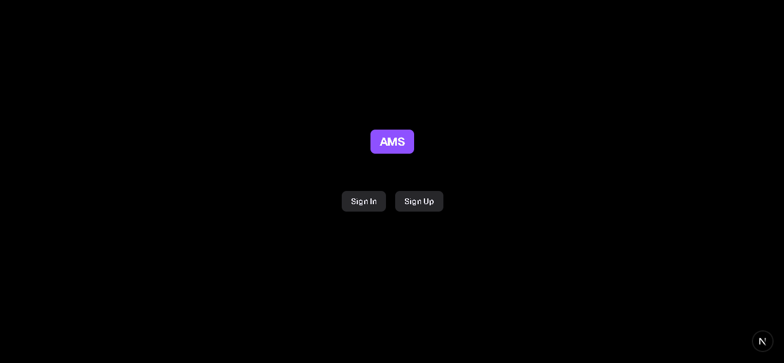
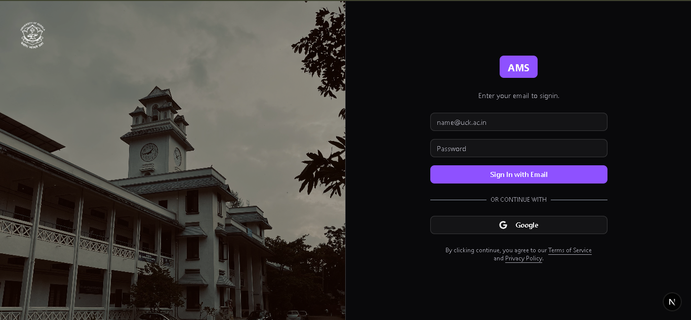
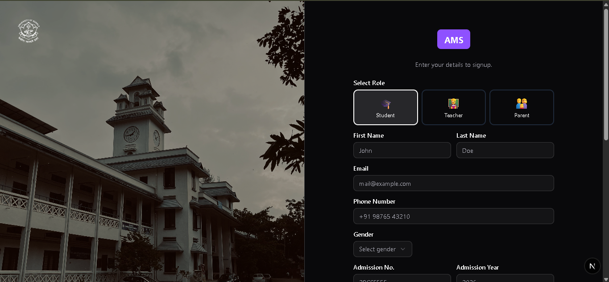

<<<<<<< HEAD
# Person Directory 👥

A Next.js-based person directory where you can add your profile and create your own personal page. This project is built with Next.js 15, TypeScript, and Tailwind CSS.
=======
<div align="center">
  
  

  [](LICENSE)
  [](https://github.com/mulearnucek/ams-frontend)
  
</div>

## 📋 Overview
> **⚠️ Note**: This project is currently under active development. Features and functionality may change.

The UCEK Attendance Management System is a comprehensive platform developed by the μLearn UCEK. This application streamlines academic tracking and management for students, teachers, and parents, providing real-time access to attendance records, grades, assignments, and more.

  #### 🌐 [Visit Live Website](https://ams.mulearn.uck.ac.in/) (dev)

## ✨ Features

### 👨‍🎓 For Students
- **Attendance Tracking**: View real-time attendance records across all subjects
- **Grade Management**: Access current grades and academic performance
- **Assignment Tracker**: Keep track of pending and submitted assignments
- **Timetable Access**: View class schedules and exam timetables
- **Notifications**: Receive alerts for low attendance, upcoming deadlines, and announcements
- **Performance Analytics**: Visual representation of academic progress

### 👨‍🏫 For Teachers
- **Attendance Logging**: Quick and efficient attendance marking system
- **Marksheet Publishing**: Upload and publish student grades and assessments
- **Assignment Management**: Create, assign, and track student assignments
- **Student Analytics**: View individual and class-wide performance metrics
- **Bulk Operations**: Perform actions for multiple students simultaneously
- **Report Generation**: Generate attendance and performance reports

### 👪 For Parents
- **Real-time Monitoring**: Track child's attendance and academic performance
- **Progress Reports**: Access detailed academic progress reports
- **Notification System**: Receive alerts about attendance, grades, and important updates
- **Communication Channel**: Direct communication with teachers and administration
- **Historical Data**: View past performance trends and records

## 📸 Screenshots





>>>>>>> aca8052b6d6f90c1e4e150078b8ca1cb466d6555

## 🚀 Getting Started

### Prerequisites
<<<<<<< HEAD

Make sure you have the following installed on your machine:
- [Node.js](https://nodejs.org/) (version 18 or higher)
- [Git](https://git-scm.com/)
- A code editor like [VS Code](https://code.visualstudio.com/)

## 🎯 How to Add Your Profile

Follow these steps to add your name and create your own profile page:

### Step 1: Fork and Clone the Repository

1. Go to the [repository page](https://github.com/mulearnucek/task-person-directory)
2. Click the "Fork" button in the top-right corner to fork it to your account
3. Clone **your forked repository**:

```bash
git clone https://github.com/YOUR_USERNAME/task-person-directory.git
cd person-directory
npm install
npm run dev
```

> **Important**: Replace `YOUR_USERNAME` with your actual GitHub username!

### Step 2: Add Your Card to the Landing Page

1. Open `src/app/page.tsx`
2. Find the section with David Brown's card
3. Add your own card after David's card. Here's the template:

### Step 3: Create Your Personal Page

1. Create a new folder in `src/app/` with your name (same as the href you used):

```bash
mkdir src/app/your-name-here
```

2. Create a folder with your name (with no spaces) and create `page.tsx` file inside the folder.
        src/app/your-name-here/page.tsx

3. Copy this template into your `page.tsx` file:

```tsx
import Navbar from "@/components/Navbar";

export default function YourNamePage() {
  return (
    <div className="min-h-screen bg-gradient-to-br from-blue-50 to-indigo-100 dark:from-gray-900 dark:to-gray-800">
      <Navbar />
      <div className="container mx-auto px-4 py-12">

        {/* Person Profile */}
        <div className="max-w-4xl mx-auto">
          <div className="bg-white dark:bg-gray-800 rounded-2xl shadow-xl overflow-hidden">
            {/* Header */}
            <div className="bg-gradient-to-r from-green-500 to-blue-600 px-8 py-12">
              <div className="flex items-center space-x-6">
                <div className="flex-shrink-0">
                  <div className="w-24 h-24 bg-blue-600 rounded-full flex items-center justify-center text-white font-semibold text-4xl">
                    Y {/* First letter of your name */}
                  </div>
                </div>
                <div className="flex-1">
                  <h1 className="text-3xl md:text-4xl font-bold text-white mb-2">
                    Your Full Name
                  </h1>
                  <p className="text-xl text-blue-100 mb-2">Your Title/Profession</p>
                  <p className="text-blue-200">Age: XX • Your Description</p>
                </div>
              </div>
            </div>

            {/* Content */}
            <div className="p-8">
              {/* Bio Section */}
              <div className="mb-8">
                <h2 className="text-2xl font-semibold text-gray-900 dark:text-white mb-4">
                  About
                </h2>
                <p className="text-gray-700 dark:text-gray-300 leading-relaxed">
                  Write a brief bio about yourself here. Talk about your background, interests, current projects, or anything you'd like others to know about you!
                </p>
              </div>

              {/* Skills Section */}
              <div className="mb-8">
                <h2 className="text-2xl font-semibold text-gray-900 dark:text-white mb-4">
                  Skills & Interests
                </h2>
                <div className="flex flex-wrap gap-3">
                  <span className="px-4 py-2 bg-blue-100 dark:bg-blue-900 text-blue-800 dark:text-blue-200 rounded-full text-sm font-medium">
                    Your Skill 1
                  </span>
                  <span className="px-4 py-2 bg-green-100 dark:bg-green-900 text-green-800 dark:text-green-200 rounded-full text-sm font-medium">
                    Your Skill 2
                  </span>
                  <span className="px-4 py-2 bg-purple-100 dark:bg-purple-900 text-purple-800 dark:text-purple-200 rounded-full text-sm font-medium">
                    Your Interest 1
                  </span>
                  {/* Add more skills/interests as needed */}
                </div>
              </div>

              {/* Contact Section */}
              <div className="mb-8">
                <h2 className="text-2xl font-semibold text-gray-900 dark:text-white mb-4">
                  Get in Touch
                </h2>
                <div className="space-y-3">
                  <div className="flex items-center space-x-3">
                    <span className="text-gray-600 dark:text-gray-400">📧</span>
                    <span className="text-gray-700 dark:text-gray-300">your.email@example.com</span>
                  </div>
                  <div className="flex items-center space-x-3">
                    <span className="text-gray-600 dark:text-gray-400">🔗</span>
                    <a href="https://linkedin.com/in/yourprofile" className="text-blue-600 dark:text-blue-400 hover:underline">
                      LinkedIn Profile
                    </a>
                  </div>
                  <div className="flex items-center space-x-3">
                    <span className="text-gray-600 dark:text-gray-400">🐙</span>
                    <a href="https://github.com/yourusername" className="text-blue-600 dark:text-blue-400 hover:underline">
                      GitHub Profile
                    </a>
                  </div>
                </div>
              </div>
            </div>
          </div>
        </div>
      </div>
    </div>
  );
}
```

**Customize this template with your own information:**
- Replace all placeholder text with your actual information
- Change the gradient colors if you want (e.g., `from-green-500 to-blue-600`)
- Add or remove skills/interests
- Update contact information with your real details

### Step 4: Test Your Changes

1. Run the development server:

```bash
npm run dev
```

2. Visit [http://localhost:3000](http://localhost:3000) to see your card on the landing page
3. Click on your card to visit your personal page
4. Make sure everything looks good and works correctly

### Step 5: Create a Pull Request

1. Add and commit your changes:

```bash
git add .
git commit -m "Add [Your Name] to person directory"
```

2. Push to your forked repository:

```bash
git push origin main
```

3. Go to your forked repository on GitHub
4. Click "Compare & pull request"
5. Add a descriptive title like "Add [Your Name] to person directory"
6. In the description, mention:
   - Your name and brief description
   - That you've added yourself to the landing page
   - That you've created your personal page

7. Click "Create pull request"

## 📝 Example

Check out the existing example:
- **David Brown** - Computer Science Student ([/david-brown](https://person-directory-beta.vercel.app/david-brown))

## 🎨 Customization Tips

- **Colors**: You can change the gradient colors in both your card and personal page
- **Skills**: Add as many skill tags as you want
- **Sections**: Feel free to add more sections like "Projects", "Education", etc.
- **Styling**: The project uses Tailwind CSS for styling

## 🛠️ Tech Stack

- **Framework**: Next.js 15
- **Language**: TypeScript
- **Styling**: Tailwind CSS

## 📧 Need Help?

If you encounter any issues or need help adding your profile:

1. Check the existing example (David Brown's page)
2. Make sure you're following the exact file structure
3. Verify that your folder name matches the href in your card
4. Open an issue in the repository if you're still stuck

---

Happy coding! 🚀
=======
- Node.js (v14 or higher)
- npm or yarn

### Installation

```bash
# Clone the repository
git clone https://github.com/mulearnucek/ams-frontend.git

# Navigate to project directory
cd ams-frontend

# Install dependencies
npm install

# Start the development server
npm run dev
```

### Environment Variables

Create a `.env` file in the root directory:

```env
NEXT_PUBLIC_API_URL=api.example.com
```

## 🛠️ Technology Stack

- **Frontend**: React.js / Next.js / Node.js
- **Backend**: Fastify / Node.js
- **Database**: MongoDB
- **UI Framework**: Shadcn Ui / Tailwind CSS

## 📱 User Roles & Permissions

| Feature | Student | Teacher | Parent | Admin |
|---------|---------|---------|--------|-------|
| View Attendance | ✅ | ✅ | ✅ | ✅ |
| Mark Attendance | ❌ | ✅ | ❌ | ✅ |
| View Grades | ✅ | ✅ | ✅ | ✅ |
| Publish Grades | ❌ | ✅ | ❌ | ✅ |
| Manage Assignments | ✅ | ✅ | ✅ | ✅ |
| System Configuration | ❌ | ❌ | ❌ | ✅ |

## 📖 User Guide

### For Students
1. Login with your enrollment number and password
2. Navigate to Dashboard to view overall statistics
3. Click on "Attendance" to see subject-wise attendance
4. Access "Grades" section for marks and assessments
5. Check "Assignments" for pending tasks and deadlines

### For Teachers
1. Login with your faculty credentials
2. Select the class/section from the dashboard
3. Mark attendance using the quick-entry interface
4. Upload marks through the "Marksheet" section
5. Create and manage assignments from the "Assignments" tab

### For Parents
1. Login using provided parent credentials
2. View your child's attendance summary
3. Access detailed performance reports
4. Set up notification preferences
5. Contact teachers through the messaging system

## 🤝 Contributing

We welcome contributions from the UCEK community! Please read our [Contributing Guidelines](CONTRIBUTING.md) before submitting pull requests.

1. Fork the repository
2. Create your feature branch (`git checkout -b feature/AmazingFeature`)
3. Commit your changes (`git commit -m 'Add some AmazingFeature'`)
4. Push to the branch (`git push origin feature/AmazingFeature`)
5. Open a Pull Request


<div align="center">
  Made with ❤️ by μLearn UCEK
  
  [Report Bug](https://github.com/mulearnucek/ams-frontend/issues) · [Request Feature](https://github.com/mulearnucek/ams-frontend/issues)
</div>
>>>>>>> aca8052b6d6f90c1e4e150078b8ca1cb466d6555
